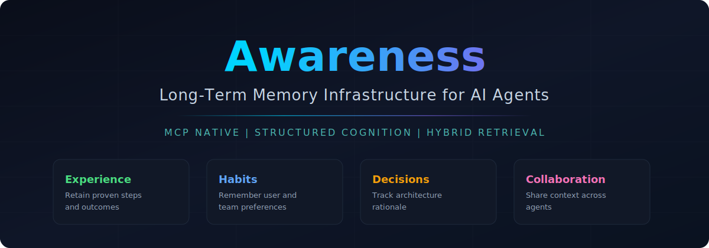
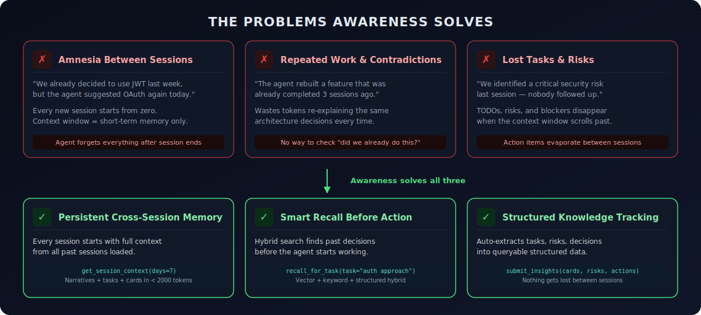
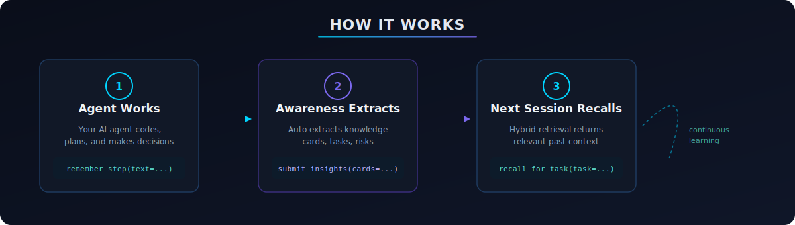
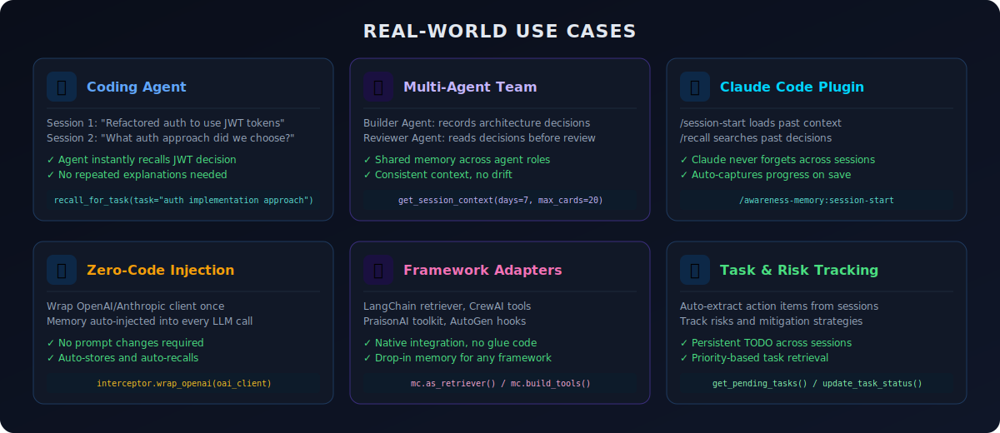
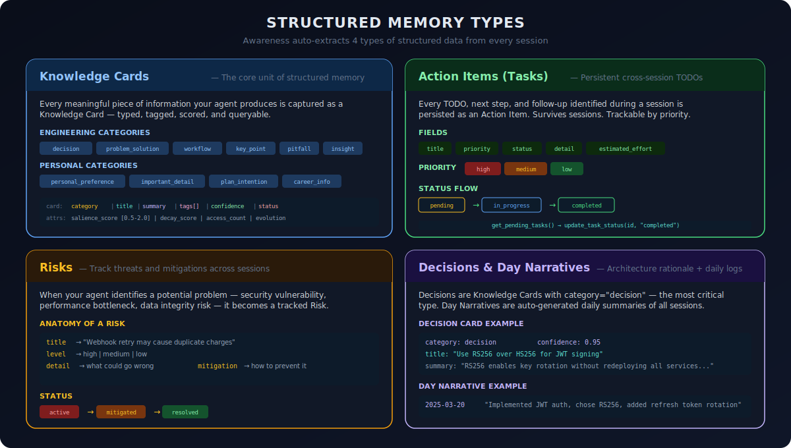
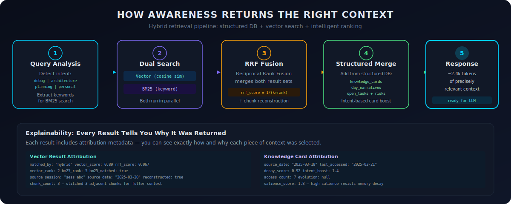
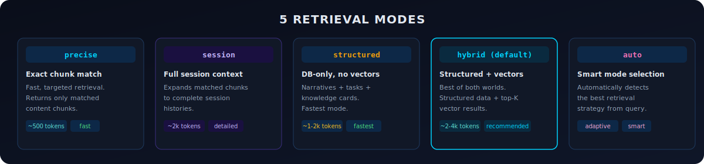
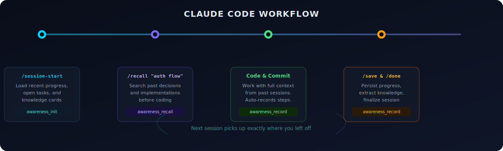

<p align="center">
  
</p>

<p align="center">
  <a href="https://pypi.org/project/awareness-memory-cloud/"></a>
  <a href="https://www.npmjs.com/package/@awareness-sdk/memory-cloud"></a>
  <a href="https://awareness.market"></a>
  <a href="LICENSE"></a>
</p>

<p align="center">
  Official SDKs and plugins for <a href="https://awareness.market">Awareness Memory Cloud</a> — persistent, cross-session memory for AI agents.<br/>
  Your agent remembers what it built, what it decided, and what still needs to be done.
</p>

Public docs hub: [https://awareness.market/docs](https://awareness.market/docs)

---

## Why Awareness?

<p align="center">
  
</p>

AI agents today have a fundamental limitation: **they forget everything when a session ends**.

Your agent spent 2 hours refactoring the auth system, made 5 architectural decisions, identified 3 risks, and left 4 TODOs. Next session? It starts from scratch. You re-explain the codebase, re-justify the same decisions, and watch it redo work it already completed.

This isn't a minor inconvenience — it's a fundamental blocker for any serious multi-session AI workflow:

- **Session amnesia**: Every new conversation starts from zero. The agent has no idea what it built yesterday, what architecture decisions were made, or what risks were identified. You end up spending the first 10 minutes of every session re-explaining context.

- **Repeated work and contradictions**: Without memory, an agent might implement a feature using a completely different approach than what was decided 3 sessions ago. Worse, it might rebuild something that was already completed — wasting tokens and creating inconsistencies.

- **Lost tasks and risks**: Your agent identifies a critical security vulnerability during session 5. By session 6, that knowledge is gone. Nobody follows up. Action items, blockers, and risks disappear when the context window scrolls past them.

**Awareness solves all three.** It gives your agent a persistent, structured memory that survives across sessions. Every session starts with full context from the past. Decisions are tracked. Tasks are persistent. Risks don't get forgotten. Your agent picks up exactly where it left off.

---

## How It Works

<p align="center">
  
</p>

1. **Your agent works** — codes, plans, makes decisions, solves problems
2. **Awareness auto-extracts** — knowledge cards, action items, risks, decisions
3. **Next session recalls** — hybrid retrieval returns the right context instantly

No manual tagging. No prompt engineering for memory. Just plug in and your agent gets long-term memory.

---

## Real-World Use Cases

<p align="center">
  
</p>

---

## Structured Memory — What Awareness Actually Stores

<p align="center">
  
</p>

When you call `remember_step()` or `submit_insights()`, Awareness doesn't just dump raw text into a vector database. It extracts and organizes your agent's output into 4 structured types, each designed for a specific purpose:

### Knowledge Cards — Your Agent's Long-Term Brain

Knowledge Cards are the core unit of Awareness memory. Every meaningful piece of information — a decision, a solution, a preference, a pitfall — is captured as a typed, tagged, scored card that can be queried months later.

**What gets captured as a card:**
- "We chose RS256 over HS256 for JWT signing because it supports key rotation" → `decision` card
- "Fixed the N+1 query in /api/users by adding a JOIN" → `problem_solution` card
- "Always run migrations in a transaction on this project" → `workflow` card
- "The /payments endpoint has a 5-second timeout — don't chain calls" → `pitfall` card
- "User prefers TypeScript over Python for backend services" → `personal_preference` card

**Every card has:**
- `category` — what type of knowledge this is (decision, problem_solution, workflow, pitfall, insight, key_point, personal_preference, etc.)
- `title` — concise one-line summary
- `summary` — detailed explanation
- `tags` — for filtering and grouping
- `confidence` (0-1) — how well-evidenced this card is. Higher confidence = more likely to appear in search results
- `salience_score` (0.5-2.0) — intrinsic importance. A high salience card (like a critical architecture decision) resists memory decay even if it hasn't been accessed recently
- `status` — open → in_progress → resolved → noted → superseded

Cards aren't static. When your agent makes a new decision that contradicts an old one, Awareness marks the old card as `superseded` and tracks the evolution — so you can see the full history of how a decision evolved over time.

### Action Items — Persistent TODOs That Survive Sessions

The biggest pain point of multi-session AI work: TODOs disappear. Your agent identifies 5 next steps at the end of session 3. By session 4, they're gone.

Awareness solves this by extracting every TODO, next step, and follow-up as a persistent **Action Item**:

- Each task has a `priority` (high/medium/low) and `estimated_effort` (small/medium/large)
- Tasks flow through statuses: `pending` → `in_progress` → `completed`
- When you start a new session, `get_pending_tasks()` returns everything that's still open
- Your agent can update task status with `update_task_status(task_id, "completed")` as it finishes work

This means your agent always knows what's left to do, regardless of how many sessions have passed.

### Risks — Tracked Threats That Don't Get Forgotten

When your agent identifies a potential problem — security vulnerability, performance bottleneck, data integrity issue — it becomes a tracked **Risk** with:

- `title` — what the risk is
- `level` — high/medium/low severity
- `detail` — what could go wrong
- `mitigation` — how to prevent it
- `status` — active → mitigated → resolved

Risks persist across sessions. Next time your agent works on related code, `recall_for_task()` surfaces relevant risks automatically. A risk identified in session 2 about "webhook retries causing duplicate charges" will appear when your agent works on the payment system in session 15.

### Day Narratives — Auto-Generated Daily Summaries

At the end of each day, Awareness auto-generates a concise narrative summarizing everything that happened across all sessions. When you start a new session, `get_session_context(days=7)` returns the last 7 days of narratives — giving your agent a quick "previously on..." briefing without needing to replay every event.

---

## How Awareness Returns the Right Context

<p align="center">
  
</p>

Storing memory is only half the problem. The harder challenge is **returning exactly the right context** — not too much (wastes tokens), not too little (misses critical info), and not the wrong stuff (leads to bad decisions).

Awareness uses a 5-stage hybrid retrieval pipeline:

### Stage 1: Query Analysis

When you call `recall_for_task(task="continue auth implementation")`, Awareness first analyzes the intent of your query. Is this a debug question? Architecture review? Planning task? Personal preference lookup? The detected intent (`debug`, `architecture`, `planning`, `personal`, `general`) determines which types of knowledge cards get boosted in results.

### Stage 2: Dual Search (Vector + BM25)

Two searches run in parallel:
- **Vector search** — embeds your query and finds semantically similar content using cosine similarity. Great for finding conceptually related content even when wording differs ("auth tokens" matches "JWT signing").
- **BM25 keyword search** — traditional keyword matching. Great for exact terms, error codes, function names, and specific identifiers that vector search might miss.

### Stage 3: Reciprocal Rank Fusion (RRF)

Results from both searches are merged using RRF — a scoring method that combines the rankings from both search methods. A result that appears in both vector and BM25 results gets a higher combined score. This eliminates the weakness of either search method alone.

Adjacent chunks are then stitched back together (**chunk reconstruction**) to return coherent, complete passages instead of fragmented snippets.

### Stage 4: Structured Data Merge

This is what makes Awareness different from a plain vector database. On top of the vector results, the system adds relevant **structured data** directly from the database:
- **Knowledge cards** — filtered by query intent (architecture questions boost `decision` cards, debug questions boost `problem_solution` cards)
- **Day narratives** — recent session summaries for timeline context
- **Open tasks** — so your agent knows what's still pending
- **Risks** — so nothing gets overlooked

Cards with higher `salience_score` resist decay and stay relevant longer. Cards that haven't been accessed recently have lower `decay_score` and may drop out — mimicking how human memory naturally prioritizes frequently-used knowledge.

### Stage 5: Response (~2-4k tokens)

The final response is a compact, precisely targeted context package ready to inject into your LLM prompt. Every result includes **attribution metadata** so you can see exactly why it was returned:

- `matched_by` — was this found by vector, BM25, or both?
- `vector_score` / `rrf_score` — numerical relevance scores
- `source_session` / `source_date` — when and where this knowledge came from
- `decay_score` — how "fresh" this memory is
- `intent_boost` — was this card boosted because of query intent matching?

This explainability means you can debug and tune retrieval quality — not just trust a black-box relevance score.

---

## Quick Start

### Python SDK

```bash
pip install awareness-memory-cloud
```

```python
from memory_cloud import MemoryCloudClient

client = MemoryCloudClient(
    base_url="https://awareness.market/api/v1",
    api_key="aw_your-api-key",
)

# Start a session
session = client.begin_memory_session(
    memory_id="your-memory-id",
    source="python-sdk",
)

# Record what your agent did
client.remember_step(
    memory_id="your-memory-id",
    text="Refactored auth middleware to use JWT tokens. Added refresh token rotation.",
    metadata={"stage": "implementation"},
)

# Next session: recall what happened
context = client.recall_for_task(
    memory_id="your-memory-id",
    task="continue auth implementation",
    limit=5,
)
print(context["results"])
```

[Full Python docs](python/README.md) | [Online docs](https://awareness.market/docs?doc=python) | [PyPI](https://pypi.org/project/awareness-memory-cloud/)

### TypeScript SDK

```bash
npm install @awareness-sdk/memory-cloud
```

```typescript
import { MemoryCloudClient } from "@awareness-sdk/memory-cloud";

const client = new MemoryCloudClient({
  baseUrl: "https://awareness.market/api/v1",
  apiKey: "aw_your-api-key",
});

const session = client.beginMemorySession({
  memoryId: "your-memory-id",
  source: "typescript-sdk",
});

await client.rememberStep({
  memoryId: "your-memory-id",
  text: "Added WebSocket handler for real-time notifications.",
  metadata: { stage: "implementation" },
});

const context = await client.recallForTask({
  memoryId: "your-memory-id",
  task: "continue notification system",
  limit: 5,
});
```

[Full TypeScript docs](typescript/README.md) | [Online docs](https://awareness.market/docs?doc=typescript) | [npm](https://www.npmjs.com/package/@awareness-sdk/memory-cloud)

---

## Usage Examples

### 1. Coding Agent — Remember Across Sessions

The most common use case: your coding agent works on a project over multiple sessions and never forgets what was done.

```python
from memory_cloud import MemoryCloudClient

client = MemoryCloudClient(
    base_url="https://awareness.market/api/v1",
    api_key="aw_xxx",
)

# === Session 1: Build auth ===
session = client.begin_memory_session(memory_id="project-alpha", source="my-agent")

client.remember_step(
    memory_id="project-alpha",
    text="Implemented JWT auth middleware with refresh token rotation. "
         "Chose RS256 over HS256 for key rotation support.",
    metadata={"stage": "implementation", "tool_name": "python"},
)

# === Session 2 (next day): Continue work ===
session = client.begin_memory_session(memory_id="project-alpha", source="my-agent")

# What did we do last time?
context = client.recall_for_task(
    memory_id="project-alpha",
    task="continue auth implementation",
    limit=8,
)
# Returns: JWT auth with RS256, refresh token rotation — full context restored

# What's still left to do?
tasks = client.get_pending_tasks(memory_id="project-alpha")
# Returns: open action items from all past sessions
```

### 2. Zero-Code LLM Injection — Wrap Once, Memory Forever

Wrap your OpenAI client once. Every LLM call automatically gets past context injected and new conversations stored.

```python
from memory_cloud import MemoryCloudClient, AwarenessInterceptor
from openai import OpenAI

client = MemoryCloudClient(
    base_url="https://awareness.market/api/v1",
    api_key="aw_xxx",
)
oai = OpenAI()

# Wrap once — memory is now automatic
interceptor = AwarenessInterceptor(
    client=client,
    memory_id="project-alpha",
    source="my-chatbot",
    user_id="user-123",
    enable_extraction=True,
)
interceptor.wrap_openai(oai)

# Every call now auto-recalls and auto-stores
response = oai.chat.completions.create(
    model="gpt-4o",
    messages=[
        {"role": "user", "content": "What auth approach did we decide on?"}
    ],
)
# The response already includes context from past sessions — no extra code needed
print(response.choices[0].message.content)
```

Or use the one-line bootstrap:

```python
from memory_cloud import bootstrap_openai_injected_session

session = bootstrap_openai_injected_session(
    owner_id="user-123",
    user_id="user-123",
    agent_role="assistant",
)

# Ready to go — memory built in
response = session.openai_client.chat.completions.create(
    model="gpt-4o",
    messages=[{"role": "user", "content": "Summarize decisions, todos, and risks."}],
)
```

### 3. Load Full Project Context at Session Start

Get a structured briefing of everything that happened in the last N days — narratives, open tasks, and knowledge cards.

```python
# Load the last 7 days of project context
context = client.get_session_context(
    memory_id="project-alpha",
    days=7,
    max_cards=20,
    max_tasks=20,
)

# Day-by-day summaries
for day in context["recent_days"]:
    print(f"{day['date']}: {day['narrative']}")

# Open tasks from all sessions
for task in context["open_tasks"]:
    print(f"[{task['priority']}] {task['title']} — {task['status']}")

# Extracted knowledge
for card in context["knowledge_cards"]:
    print(f"[{card['category']}] {card['title']}: {card['summary']}")
```

### 4. Submit Structured Insights (No Server LLM Required)

If your agent already extracts knowledge, submit it directly — zero server-side LLM cost.

```python
client.submit_insights(
    memory_id="project-alpha",
    insights={
        "knowledge_cards": [
            {
                "category": "decision",
                "title": "Use Redis Streams for async events",
                "summary": "Chose Redis Streams over Kafka for lower operational complexity. "
                           "PostgreSQL remains source of truth.",
                "tags": ["architecture", "redis", "async"],
                "confidence": 0.95,
                "status": "noted",
            }
        ],
        "risks": [
            {
                "title": "Webhook retry duplication",
                "level": "high",
                "detail": "Without idempotency keys, webhook retries may cause "
                          "duplicate downstream charges.",
                "mitigation": "Add idempotency key validation on all write endpoints.",
            }
        ],
        "action_items": [
            {
                "title": "Add idempotency keys to write endpoints",
                "priority": "high",
                "estimated_effort": "medium",
            }
        ],
    },
)
```

### 5. Backfill Past Conversations

Already have conversation logs? Load them into Awareness for instant memory.

```python
result = client.backfill_conversation_history(
    memory_id="project-alpha",
    history=[
        {"role": "user", "content": "Let's use PostgreSQL for the main database"},
        {"role": "assistant", "content": "Good choice. I'll set up the schema with..."},
        {"role": "user", "content": "Add a users table with email as unique key"},
        {"role": "assistant", "content": "Done. Created users table with..."},
    ],
    source="slack-import",
    generate_summary=True,
)
```

---

## Retrieval Modes

<p align="center">
  
</p>

```python
# Precise — fast, targeted chunk matching
result = client.retrieve(memory_id="...", query="JWT signing algorithm", recall_mode="precise")

# Session — expand matches to full session histories
result = client.retrieve(memory_id="...", query="auth decisions", recall_mode="session")

# Structured — DB-only, no vectors (fastest, ~1-2k tokens)
result = client.retrieve(memory_id="...", query="open tasks", recall_mode="structured")

# Hybrid (default) — structured data + top-K vector results
result = client.recall_for_task(memory_id="...", task="continue auth work")

# Auto — let Awareness pick the best mode
result = client.retrieve(memory_id="...", query="what happened yesterday?", recall_mode="auto")
```

---

## Claude Code Plugin

<p align="center">
  
</p>

Give Claude Code persistent memory that survives across sessions. No more forgetting what was built, repeating architectural decisions, or losing track of open TODOs.

### Install

```bash
claude plugin install -l ./claudecode
```

### Configure

```json
{
  "env": {
    "AWARENESS_MCP_URL": "https://awareness.market/mcp",
    "AWARENESS_MEMORY_ID": "your-memory-id",
    "AWARENESS_API_KEY": "aw_your-api-key",
    "AWARENESS_AGENT_ROLE": "builder_agent"
  }
}
```

[Full Claude Code docs](claudecode/README.md) | [Online docs](https://awareness.market/docs?doc=ide-plugins)

Get your credentials from [Awareness Dashboard](https://awareness.market/dashboard) → Connect tab.

### Daily Workflow

```
# Start of session — load context from past sessions
> /awareness-memory:session-start

# Before implementing — check if related work exists
> /awareness-memory:recall "payment webhook handler"

# After completing work — persist progress
> /awareness-memory:save

# End of session — finalize and extract knowledge
> /awareness-memory:done
```

| Skill | When to Use |
|-------|-------------|
| `/awareness-memory:session-start` | Start of every session — loads recent progress, tasks, context |
| `/awareness-memory:recall <query>` | Before implementing — check if it already exists |
| `/awareness-memory:save` | After completing a step or before ending a session |
| `/awareness-memory:done` | End of session — finalize and persist all progress |

[Full Claude Code docs](claudecode/README.md)

---

## Framework Integrations

### LangChain

```python
from memory_cloud.integrations.langchain import MemoryCloudLangChain

mc = MemoryCloudLangChain(client=client, memory_id="project-alpha")

# Use as a LangChain Retriever
retriever = mc.as_retriever()
docs = retriever._get_relevant_documents("What auth changes were made?")

# Or direct search/write
result = mc.memory_search(query="database decisions", limit=5)
mc.memory_write(content="Migrated user table to use UUIDs.")
```

### CrewAI

```python
from memory_cloud.integrations.crewai import MemoryCloudCrewAI

mc = MemoryCloudCrewAI(client=client, memory_id="project-alpha")
mc.wrap_llm(openai.OpenAI())  # Auto-inject memory into CrewAI agents

result = mc.memory_search("What deployment strategy did we choose?")
```

### PraisonAI

```python
from memory_cloud.integrations.praisonai import MemoryCloudPraisonAI

mc = MemoryCloudPraisonAI(client=client, memory_id="project-alpha")
tools = mc.build_tools()  # Get tool dicts for PraisonAI agent config
```

### AutoGen / AG2

```python
from memory_cloud.integrations.autogen import MemoryCloudAutoGen

mc = MemoryCloudAutoGen(client=client, memory_id="project-alpha")
mc.inject_into_agent(assistant)  # Hook into agent message processing
mc.register_tools(caller=assistant, executor=user_proxy)
```

Install framework extras:

```bash
pip install awareness-memory-cloud[langchain]   # LangChain
pip install awareness-memory-cloud[crewai]      # CrewAI
pip install awareness-memory-cloud[autogen]     # AutoGen
pip install awareness-memory-cloud[frameworks]  # All frameworks
```

---

## OpenClaw Plugin

Memory plugin for [OpenClaw](https://openclaw.ai) agents.

```bash
openclaw plugins install @awareness-sdk/openclaw-memory
```

Provides the same 4 core MCP tools (`awareness_init`, `awareness_recall`, `awareness_lookup`, `awareness_record`) with automatic lifecycle hooks for session management.

[Full OpenClaw docs](openclaw/README.md) | [Online docs](https://awareness.market/docs?doc=openclaw) | [npm](https://www.npmjs.com/package/@awareness-sdk/openclaw-memory)

---

## MCP Tools Reference

All plugins expose 4 core tools via MCP:

| Tool | Description | Key Parameters |
|------|-------------|----------------|
| `awareness_init` | Initialize session + load context | `days`, `max_cards`, `max_tasks` |
| `awareness_recall` | Semantic + keyword hybrid search | `semantic_query`, `recall_mode`, `limit` |
| `awareness_lookup` | Structured data retrieval | `type`: context, tasks, knowledge, risks, timeline |
| `awareness_record` | All writes: remember, batch, backfill | `action`, `text`, `steps`, `metadata` |

---

## Environment Variables

All SDKs and plugins share the same environment variable naming:

| Variable | Description | Default |
|----------|-------------|---------|
| `AWARENESS_API_BASE_URL` | API endpoint | `https://awareness.market/api/v1` |
| `AWARENESS_MCP_URL` | MCP endpoint | `https://awareness.market/mcp` |
| `AWARENESS_API_KEY` | API key (`aw_...`) | — |
| `AWARENESS_MEMORY_ID` | Memory ID | — |
| `AWARENESS_AGENT_ROLE` | Agent role filter | — |

---

## Contributing

Contributions are welcome! Please open an issue or pull request on [GitHub](https://github.com/edwin-hao-ai/Awareness-SDK).

## License

Apache 2.0
